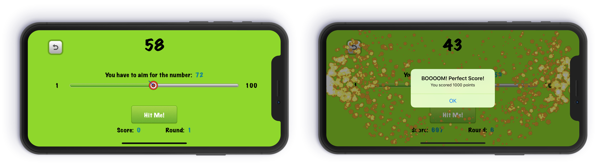

# AimForThat
> Simple game developed in the udemy course ["Curso completo de iOS 11 y Swift: de cero a experto con JB"](https://www.udemy.com/ios11-swift4/) of "Juan Gabriel Gomila Salas"

This is a simple game started from an udemy course which I continued to develop.

## Features added by me:
* Taptic Feedback
* Particle emitters with Spritekit
* Use of timer
* Portrait & Landscape

## Meta

Tobias Ruano – [@tobiasruano](https://twitter.com/tobiasruano) – truano@uade.edu.ar

Distributed under the MIT License. See ``LICENSE`` for more information.

[https://github.com/TobiasRuano/AimForThat](https://github.com/TobiasRuano/AimForThat)
